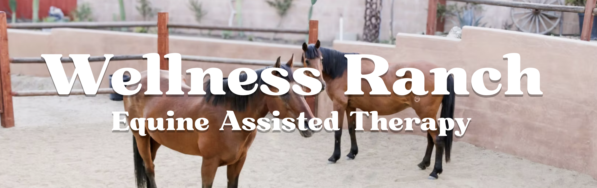

Local SEO Analysis
--- 

### Wellness Ranch Therapy

-   This project focuses on local online visibity of Wellness Ranch Therapy using SEMrush Local SEO tools.
    -   This is where we looked areas that needed improvement such Google Business Profile optimization, claiming Yelp business, and review what is impacting their local search performance.
    -   Proposal included in completing business information, missing listings, and encourage reviews for the organization.
    
#### Key Areas

1. Local SEO 
2. SEMrush local
3. Google Business Profile Optimization
4. Digital Presence Analysis

Email Marketing Campaign Analysis
---

### Trauma Resource Institute

- This project is focused on improving email marketing, by providing feedback of email campaigns in order to reach their End-of-Year Scholarship Fund campaign. Using tools from Canva and Google docs in order to assess layouts, accessibility of links, and to resonate with audiences.

### Key Areas

1. Email marketing
2. Audience resonance
3. Infromation accessibility
4. Nonprofit outreach
5. Campaign for Scholarship Funding
